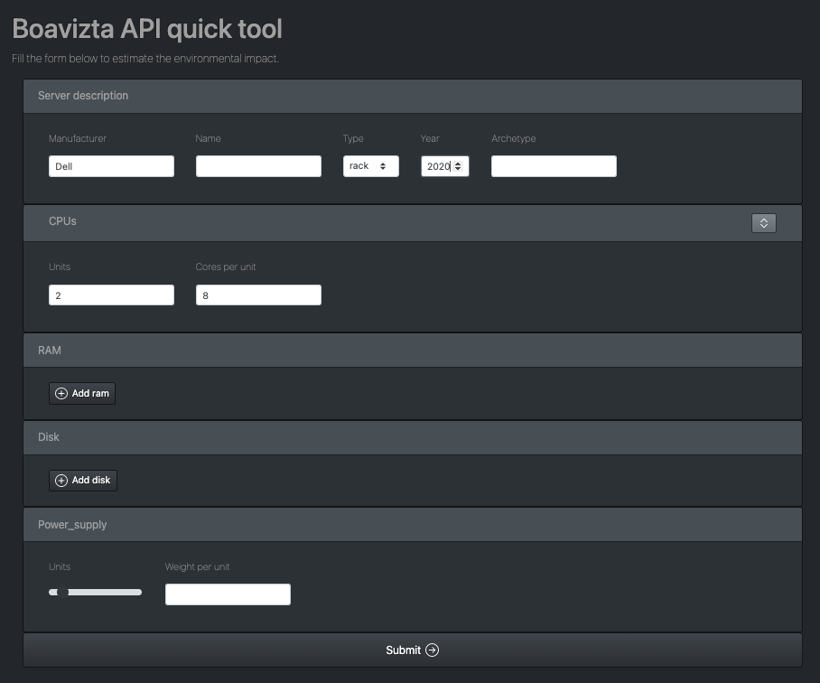
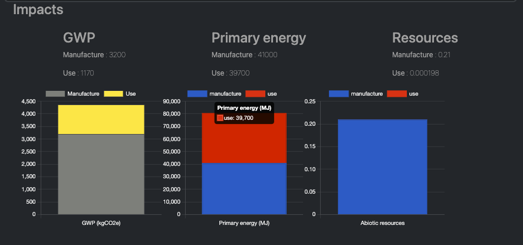

# Boaviztapi Front

This project aims at building small intuitive front ends for quick access to the https://api.boavizta.org/docs api.

Currently, the PoC frontend is built with the DLite low-code tool, so that it should be easy to adapt, style and extends, even for non-programmers.

## Get started

- Clone this repo
- With your favorite browser, go to https://platform.dlite.org
- Click on the ``Load project file`` button
- Select the ``boavizta.dlite`` file on your local disk

You should see the following screen:

## How to use

- Edit the form to enter the values (note that if you do not enter any value, the API will still return a default result)
- Press the ``Submit`` button

You should see a result looking like this:

## How to modify/extend/style the frontend UI

Modifying the front can be done live by clicking on the edit button (top-right corner of the page). Please refer to the documentation at https://www.dlite.io to get started with DLite. 

